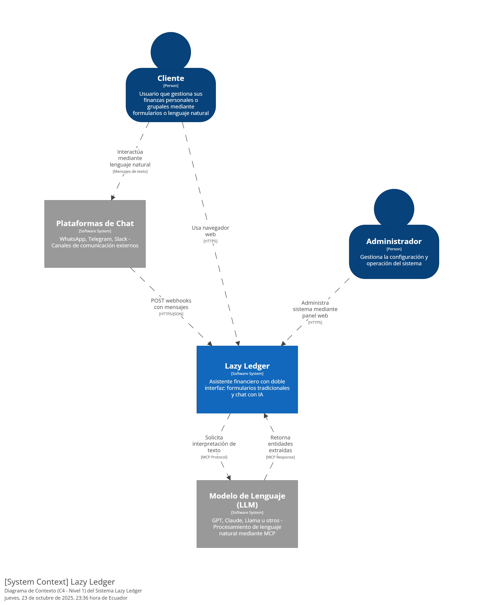
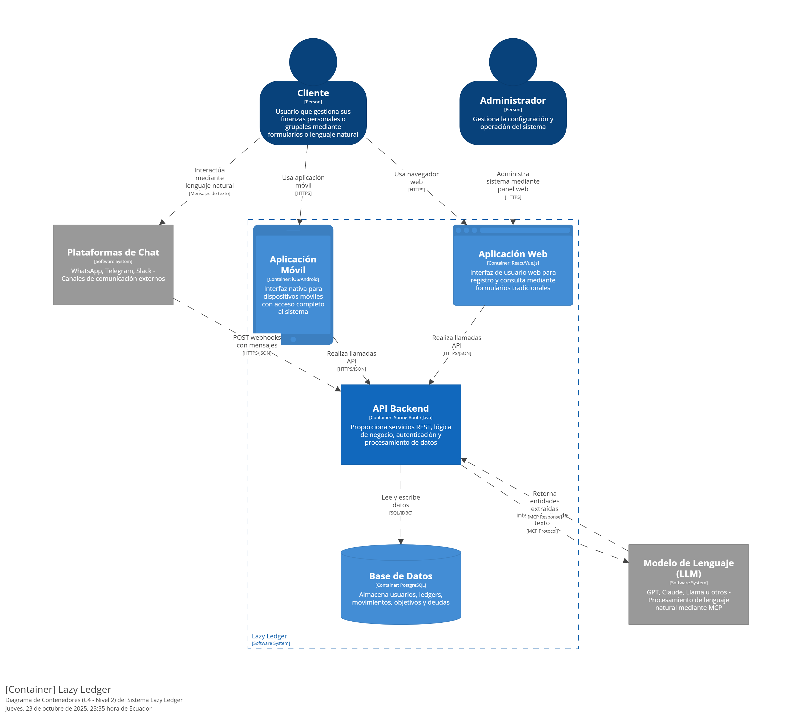
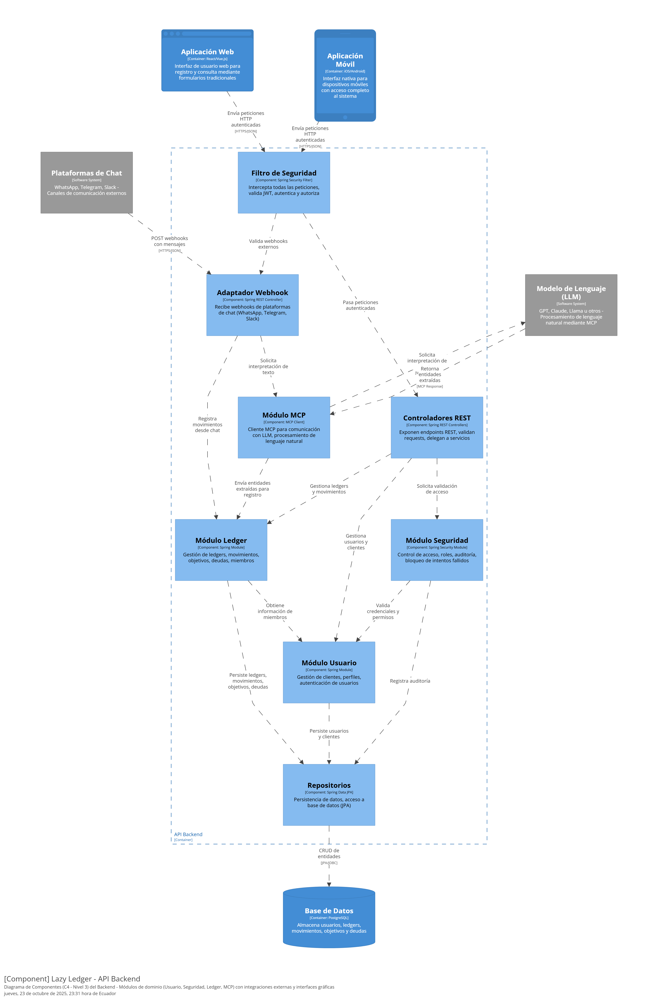

# lazy_ledger

# Requerimientos del Proyecto

Para la recopilación detallada de requisitos para el desarrollo de la aplicación, consulte [requirements.md](requirements.md).

# Arquitectura seleccionada.

Basándonos en los requisitos funcionales y no funcionales, y utilizando Spring Boot para el desarrollo del backend, hemos optado por una Arquitectura orientada a la Web con una API RESTful y una interfaz de Bot de Telegram. Esta elección nos permite alcanzar altos niveles de escalabilidad, modularidad y resiliencia.

Componentes Principales
La arquitectura se compone de los siguientes elementos clave:
Backend (Spring Boot):
Módulos principales: Gestiona la autenticación, registro de usuarios, gestión de perfiles, creación y gestión de libros contables, invitaciones, asignación de roles, y procesamiento de transacciones.
Base de Datos (PostgreSQL):
Una base de datos relacional robusta para almacenar usuarios, libros contables, transacciones, roles y otra información estructurada. Elegida por su fiabilidad y escalabilidad.
Bot de Telegram:
Una interfaz conversacional que permite a los usuarios interactuar con el sistema Lazy Ledger. Proporciona menús y mensajes claros.
ASR & NLP Service (Reconocimiento de Voz y PNL):
Un servicio dedicado a transformar grabaciones de audio en texto y extraer información relevante para la creación de transacciones contables.

# Flujo de trabajo con GitFlow.

Este proyecto utiliza el flujo de trabajo **GitFlow** para gestionar el código fuente. A continuación se describen las ramas principales:

*   **`main`**: Esta rama contiene el código estable y listo para producción. Cada commit en `main` es una nueva versión.
*   **`develop`**: Es la rama principal de desarrollo. Integra todas las funcionalidades terminadas que se incluirán en la próxima versión.

### Ramas de Soporte

*   **`feature/<nombre-feature>`**: Se crean a partir de `develop` para trabajar en nuevas funcionalidades. Al finalizar, se fusionan de nuevo en `develop`.
    *   Ejemplo: `feature/autenticacion-jwt`
*   **`release/<version>`**: Se crean desde `develop` cuando se prepara un nuevo lanzamiento. Permiten realizar pruebas finales y corregir errores menores. Una vez lista, la rama se fusiona en `main` y `develop`.
    *   Ejemplo: `release/v1.2.0`
*   **`hotfix/<version>`**: Se crean a partir de `main` para solucionar errores críticos en producción. Una vez resuelto el problema, se fusionan tanto en `main` como en `develop`.
    *   Ejemplo: `hotfix/v1.1.1`

### Instrucciones Actualizadas para Docker

#### Prerrequisitos
- Asegúrate de tener Docker y Docker Compose instalados en tu sistema.

#### Paso 1: Navegar al Directorio del Backend
Abre una terminal y navega al directorio del backend.

#### Paso 2: Construir las Imágenes de Docker
Construye las imágenes necesarias.

#### Paso 3: Iniciar los Contenedores
Ejecuta los contenedores.

Esto iniciará:
- El contenedor de PostgreSQL (`lazy_ledger_postgres`) en el puerto 5432 con la base de datos `lazy_ledger_db`.
- El contenedor de la aplicación Spring Boot (`lazy_ledger_app`) en el puerto 8090.

La aplicación esperará a que PostgreSQL esté saludable antes de iniciarse.

#### Paso 4: Verificar el Funcionamiento
- La aplicación estará disponible en http://localhost:8090
- Los logs se mostrarán en la consola.
- PostgreSQL incluye un healthcheck que verifica la conectividad cada 10 segundos.

#### Configuración Actualizada
- **Base de Datos**:
  - Host: postgres (nombre del servicio en Docker Compose)
  - Puerto: 5432
  - Base de datos: lazy_ledger_db
- **Aplicación**:
  - Puerto: 8090

#### Detener los Contenedores
Para detener y eliminar los contenedores.

Esto también eliminará los volúmenes de datos de PostgreSQL.

## Desarrollo Local

Para desarrollo local sin contenedores, actualiza `application.properties` para usar configuración local.

Y ejecuta PostgreSQL localmente con la base de datos `lazyledger_db`.

## Documentación de la API

La API está documentada usando **OpenAPI 3.0** y **Swagger UI** para proporcionar una interfaz interactiva.

### Tecnologías de Documentación
- **SpringDoc OpenAPI**: Genera automáticamente la documentación OpenAPI desde las anotaciones del código
- **Swagger UI**: Interfaz web interactiva para explorar y probar los endpoints

### Endpoints de Documentación
- **Swagger UI**: `http://localhost:8090/swagger-ui.html`
- **OpenAPI JSON**: `http://localhost:8090/api-docs`

### Módulos Documentados
- **Cliente**: Gestión completa de clientes (persona/empresa)
  - Crear, leer, actualizar y eliminar clientes
  - Validaciones de negocio y formato de datos
  - Paginación en listados
  - Manejo de errores específico
- **MiembroLedger**: Gestión de membresías en ledgers colaborativos
  - Invitaciones, cambios de rol, expulsiones
  - Validaciones de permisos de propietario
  - Headers de autorización preparados

### Arquitectura del Sistema (C4 Model)

La arquitectura del sistema Lazy Ledger sigue el modelo C4 (Context, Containers, Components, Code) para una documentación estructurada y jerárquica:

#### Nivel 1: Diagrama de Contexto

Muestra el sistema Lazy Ledger en su contexto general, incluyendo usuarios (Cliente, Administrador) y sistemas externos (Plataformas de Chat, LLM).

#### Nivel 2: Diagrama de Contenedores

Detalla los contenedores principales del sistema: Aplicación Web, Aplicación Móvil, API Backend y Base de Datos.

#### Nivel 3: Diagrama de Componentes

Profundiza en la arquitectura del Backend, mostrando los módulos de dominio (Usuario, Seguridad, Ledger), adaptadores de integración y repositorios.

#### Nivel 4: Modelo de Dominio (UML)

### Documentación Técnica Detallada
Para información técnica completa de la API, consulte el **[Mini-Dossier Técnico API RESTful](Mini-Dossier-Tecnico-API.md)** que incluye:
- Especificaciones detalladas de todos los endpoints
- Modelos de datos completos con ejemplos JSON
- Principios RESTful implementados
- Manejo de errores y códigos de estado
- Arquitectura e implementación técnica

### Registro de Prompts de IA
Para ver el registro completo de prompts utilizados con la IA durante el desarrollo, consulte **[Registro-Prompts.md](Registro-Prompts.md)**.

### Especificaciones Generales
- **Autenticación**: Headers personalizados preparados
- **Formato**: JSON para requests y responses
- **Códigos HTTP**: Estándar REST (200, 201, 400, 403, 404, 409, 422, 500)
- **Paginación**: Parámetros `page` (0-based) y `size` (máx. 100) en endpoints de listado
- **IDs**: Formato UUID v7 para unicidad temporal
- **Validaciones**: Tanto a nivel de dominio como aplicación
- **Arquitectura**: Clean Architecture con separación de capas