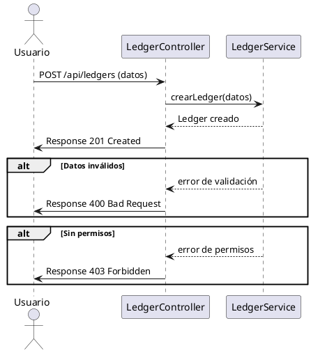

# Diagrama de secuencia: Crear Ledger (MVC simplificado)

```plantuml
@startuml
actor Usuario
participant "LedgerController" as Controller
participant "LedgerService" as Service

Usuario -> Controller : POST /api/ledgers (datos)
Controller -> Service : crearLedger(datos)
Service --> Controller : Ledger creado
Controller -> Usuario : Response 201 Created

alt Datos inválidos
  Service --> Controller : error de validación
  Controller -> Usuario : Response 400 Bad Request
end

alt Sin permisos
  Service --> Controller : error de permisos
  Controller -> Usuario : Response 403 Forbidden
end

@enduml
```
