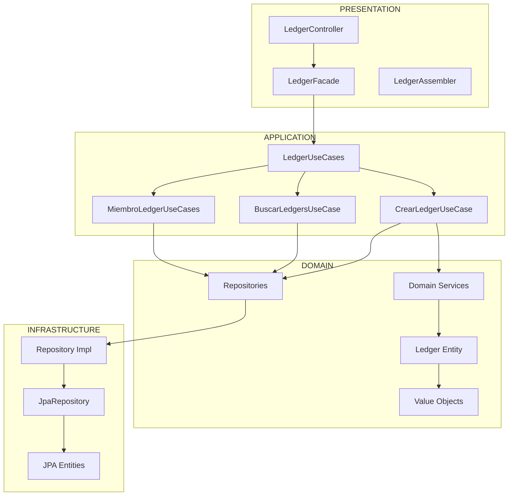

# Arquitectura del Módulo Ledger - Lazy Ledger

## Diagrama de Arquitectura de Alto Nivel



## Flujo de Datos Típico

```
Client → Controller → Facade → UseCase → DomainService → Repository → JpaImpl → Database
    ↑         ↑         ↑         ↑         ↑             ↑         ↑         ↑
   201     Response  ApiResponse  Ledger    Business   Interface  Impl     SQL
 Created  Entity      +HATEOAS   Entity    Rules       Contract  JPA
```

## Responsabilidades por Capa

### 🎨 **Presentation Layer**
- **LedgerController**: Endpoints REST, validación básica de entrada
- **LedgerFacade**: Adaptador que maneja ResponseEntity, HttpStatus, excepciones de framework
- **LedgerAssembler**: Construye respuestas con HATEOAS, mapea DTOs

### 🔧 **Application Layer**
- **Use Cases**: Lógica compleja de aplicación, coordinan múltiples operaciones
- **Validaciones de negocio**: Reglas transversales, autorizaciones
- **Transacciones**: @Transactional para operaciones complejas
- **Manejo de excepciones**: Convierte excepciones de dominio en de aplicación

### 🏛️ **Domain Layer**
- **Entities**: Reglas de negocio puras, estado consistente
- **Domain Services**: Lógica compleja de dominio (sin @Service)
- **Value Objects**: Objetos inmutables con validaciones
- **Repository Interfaces**: Contratos puros de persistencia

### 🔌 **Infrastructure Layer**
- **Repository Impl**: Implementaciones JPA/Hibernate
- **JPA Entities**: Mapeo a base de datos
- **External Services**: JWT, Email, Cache, etc.
- **Configuration**: Beans, properties, migraciones

## Principios Arquitectónicos

### **Clean Architecture**
- Las capas externas dependen de las internas, nunca al revés
- Las dependencias apuntan hacia el centro (Domain)

### **SOLID Principles**
- **SRP**: Cada clase tiene una responsabilidad única
- **OCP**: Abierto a extensión, cerrado a modificación
- **LSP**: Los repositorios son sustituibles
- **ISP**: Interfaces específicas por módulo
- **DIP**: Depende de abstracciones, no de implementaciones

### **Domain-Driven Design**
- **Entities** con identidad y estado
- **Value Objects** inmutables
- **Domain Services** para lógica compleja
- **Repository Pattern** para persistencia

## Beneficios de Esta Arquitectura

1. **Testabilidad**: Cada capa se puede testear en aislamiento
2. **Mantenibilidad**: Cambios en infraestructura no afectan dominio
3. **Escalabilidad**: Nuevas implementaciones sin cambiar lógica de negocio
4. **Separación de Concerns**: Cada capa tiene responsabilidades claras
5. **Reutilización**: Use Cases se pueden reutilizar en diferentes presentaciones